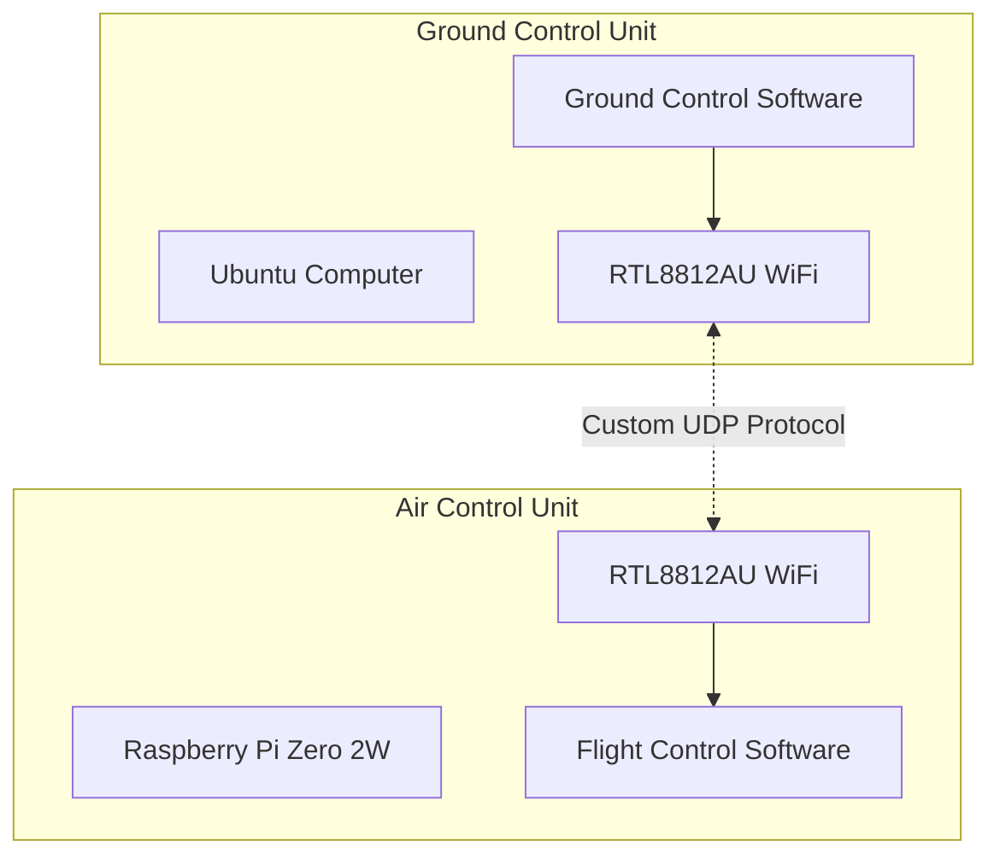
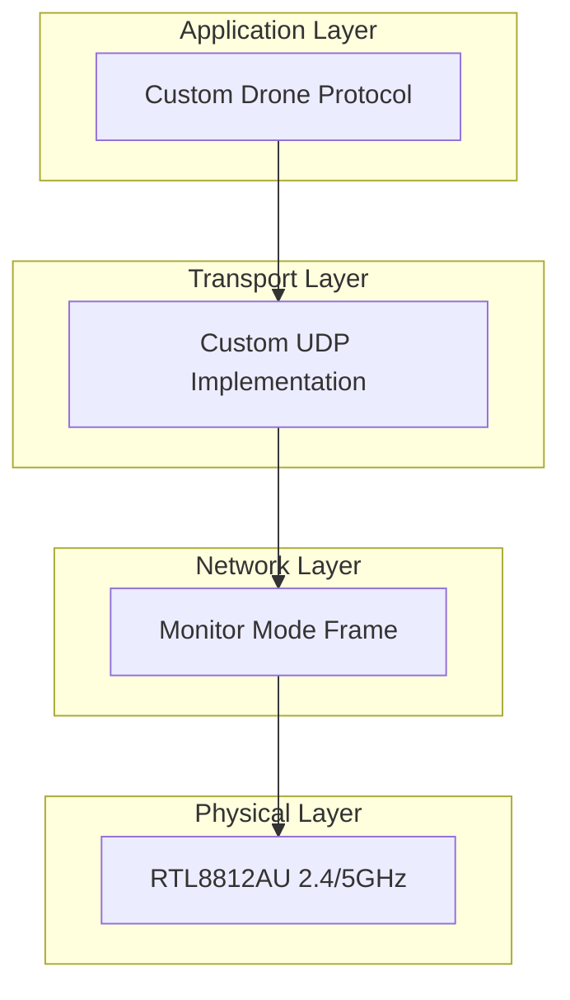
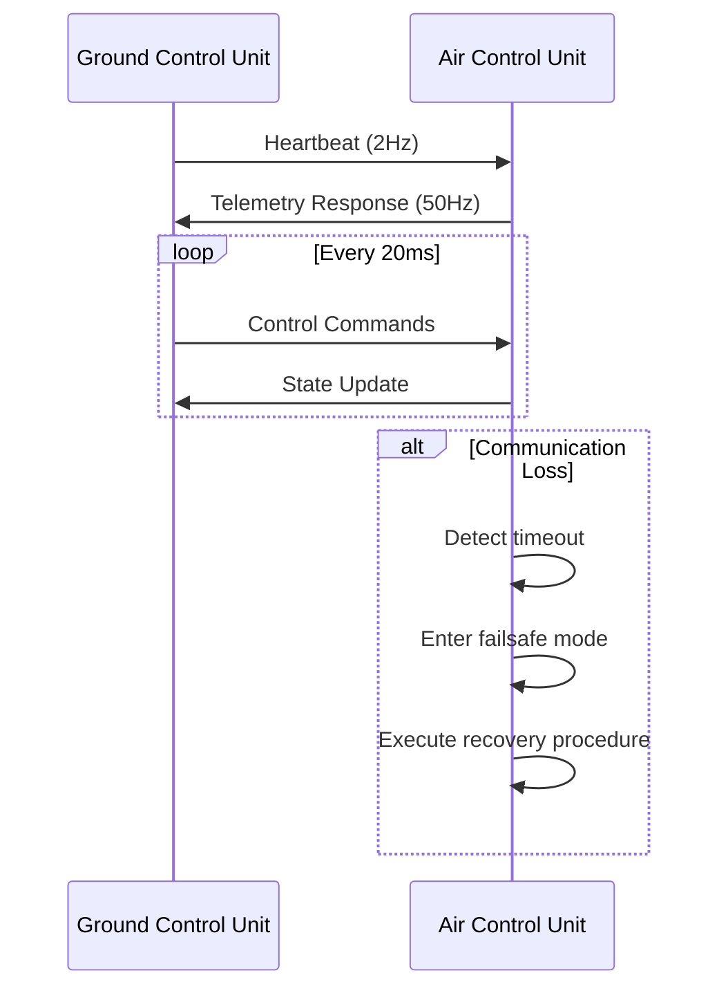
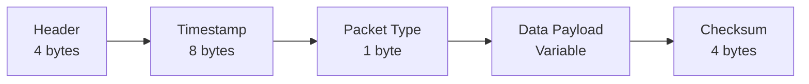
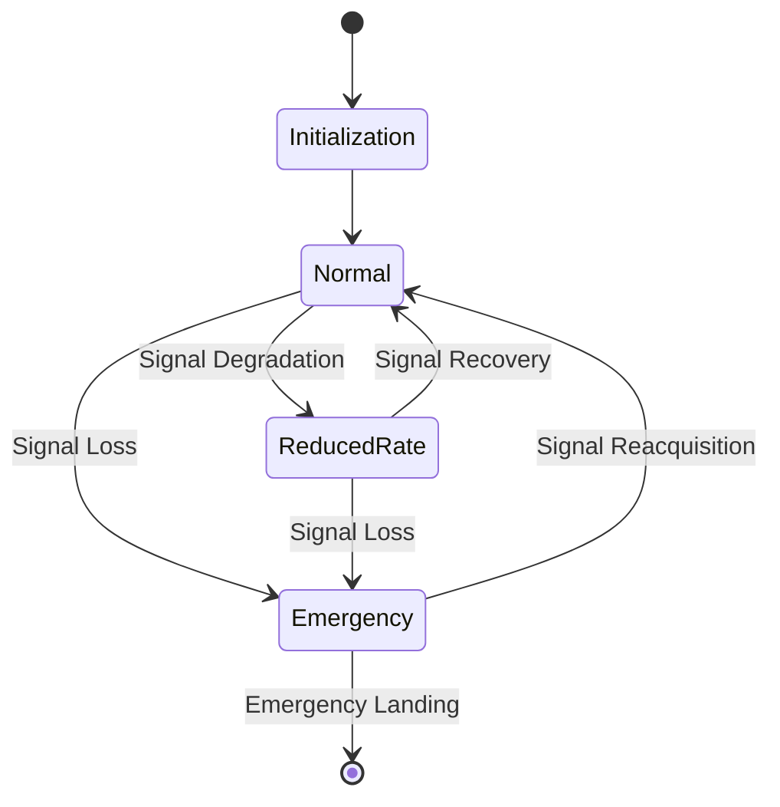

# Fixed Wing Drone Communication System Design
Version: 1.0.0  
Last Updated: 2024

## Table of Contents
1. [System Overview](#system-overview)
2. [Requirements](#requirements)
3. [Communication Architecture](#communication-architecture)
4. [Protocol Design](#protocol-design)
5. [Failsafe Mechanisms](#failsafe-mechanisms)
6. [Performance Considerations](#performance-considerations)
7. [Security Considerations](#security-considerations)

## System Overview

The communication system establishes a reliable, low-latency link between a ground control unit (GCU) running Ubuntu and an air control unit (ACU) running on a Raspberry Pi Zero 2W. The system utilizes Realtek 8812au WiFi chips operating in monitor mode to facilitate direct communication through custom UDP packets.

### High-Level Architecture

## Requirements

### Core Requirements

1. **Range Performance**
   - Maintain reliable communication up to 1 kilometer
   - Account for line-of-sight limitations and potential interference
   - Implement signal strength monitoring and quality metrics

2. **Emergency Management**
   - Automated response to communication loss
   - Configurable failsafe behaviors
   - Return-to-home capabilities
   - Local autonomous decision making on ACU

3. **Real-time Control**
   - Minimum 50Hz communication rate
   - Maximum acceptable latency: 20ms
   - Guaranteed delivery mechanism for critical commands
   - Efficient packet structure for minimal overhead

### Technical Specifications

| Parameter | Specification |
|-----------|--------------|
| Minimum Update Rate | 50 Hz |
| Maximum Latency | 20 ms |
| Range | 1 km |
| WiFi Hardware | RTL8812AU |
| Operating Mode | Monitor Mode |
| Protocol Base | Custom UDP |
| Ground OS | Ubuntu |
| Air OS | Raspberry Pi OS |

## Communication Architecture

### Protocol Stack

### Communication Flow

## Protocol Design

### Packet Structure

### Packet Types

1. **Control Packets (0x01)**
   - Flight control commands
   - Update rate: 50Hz
   - Priority: High
   - Size: ~32 bytes

2. **Telemetry Packets (0x02)**
   - Drone state information
   - Update rate: 50Hz
   - Priority: Medium
   - Size: ~64 bytes

3. **Heartbeat Packets (0x03)**
   - Connection maintenance
   - Update rate: 2Hz
   - Priority: High
   - Size: 16 bytes

4. **Configuration Packets (0x04)**
   - System configuration
   - Update rate: On-demand
   - Priority: Low
   - Size: Variable

### Communication Modes

## Failsafe Mechanisms

### Signal Loss Detection

- Heartbeat timeout: 1500ms (3 missed packets)
- RSSI threshold monitoring
- Packet loss rate tracking

### Recovery Procedures

1. **Stage 1 - Initial Loss (0-500ms)**
   - Maintain last known good commands
   - Increase transmission power
   - Switch to redundant frequencies

2. **Stage 2 - Extended Loss (500ms-2s)**
   - Enter autonomous mode
   - Begin return-to-home calculation
   - Broadcast emergency beacon

3. **Stage 3 - Critical Loss (>2s)**
   - Execute return-to-home
   - Maintain minimum safe altitude
   - Prepare for autonomous landing

## Performance Considerations

### Latency Management

1. **Packet Optimization**
   - Minimal header size
   - Efficient data serialization
   - Priority-based queuing

2. **Processing Efficiency**
   - Zero-copy buffer management
   - Interrupt-driven packet processing
   - Real-time thread scheduling

### Bandwidth Utilization

| Packet Type | Size (bytes) | Frequency (Hz) | Bandwidth (KB/s) |
|-------------|--------------|----------------|------------------|
| Control     | 32          | 50             | 1.6             |
| Telemetry   | 64          | 50             | 3.2             |
| Heartbeat   | 16          | 2              | 0.032           |
| Total       | -           | -              | 4.832           |

## Security Considerations

1. **Packet Authentication**
   - Timestamp verification (ensure freshness)
   - Checksum verification
   - Stale packet rejection

2. **Interference Mitigation**
   - Frequency hopping capability
   - Dynamic power adjustment
   - Channel monitoring

3. **Data Protection**
   - Command validation
   - Latest packet prioritization
   - Corrupt packet rejection
   - Stale packet detection and discard

### Packet Processing Priority
1. **Latest Data Priority**
   - Always process most recent packet
   - Discard older packets based on timestamp
   - No packet reordering or buffering
   - Immediate processing of valid packets

2. **Timestamp Handling**
   - Microsecond precision timestamps
   - Synchronized time between GCU and ACU
   - Rolling window for valid timestamps
   - Automatic stale packet rejection

3. **Real-time Processing**
   - Zero-buffering policy
   - Immediate packet validation
   - Direct processing pipeline
   - Minimal processing overhead

## Future Considerations

1. **Extensibility**
   - Support for additional sensors
   - Enhanced autonomous capabilities
   - Advanced flight control algorithms

2. **Optimization Opportunities**
   - Dynamic packet rates
   - Adaptive power management
   - Enhanced error correction

3. **Integration Points**
   - Flight controller interface
   - Ground station software
   - Mission planning system 