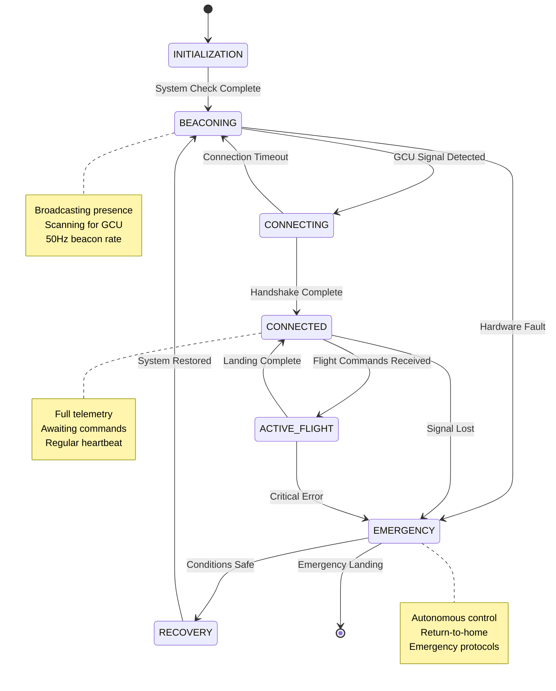

# Drone State Machine Design
Version: 1.0.0  
Last Updated: 2024

## Table of Contents
1. [Overview](#overview)
2. [State Definitions](#state-definitions)
3. [State Transitions](#state-transitions)
4. [State Behaviors](#state-behaviors)
5. [Safety Considerations](#safety-considerations)

## Overview

The drone state machine defines the core operational states and transitions that govern the drone's behavior. This system ensures safe operation, reliable communication with the Ground Control Unit (GCU), and appropriate responses to various operational scenarios.

### State Machine Diagram

## State Definitions

### 1. INITIALIZATION
- Initial state on power-up
- Performs system checks and sensor calibration
- Validates all critical systems
- Duration: Typically 5-10 seconds

### 2. BEACONING
- Actively broadcasts presence to GCU
- Scans for GCU signals across configured channels
- Monitors battery and system health
- Implements progressive scanning strategy
- Beacon rate: 50Hz

### 3. CONNECTING
- Establishes secure connection with GCU
- Performs three-way handshake
- Validates authentication tokens
- Configures communication parameters
- Timeout: 5 seconds

### 4. CONNECTED
- Maintains stable link with GCU
- Processes latest control commands
- Transmits current telemetry data
- Monitors connection quality
- Heartbeat rate: 2Hz
- Zero-buffering packet processing

### 5. ACTIVE_FLIGHT
- Executing latest flight commands
- Real-time motion control
- Enhanced telemetry reporting
- Active obstacle avoidance
- Control rate: 50Hz
- Immediate command processing

### 6. EMERGENCY
- Autonomous decision making
- Return-to-home procedures
- Emergency landing protocols
- Broadcast emergency beacon
- Maximum safe operation

### 7. RECOVERY
- System restoration attempts
- Diagnostic checks
- Safe mode operations
- Connection re-establishment

## State Transitions

### Normal Operation Flow
1. **Initialization → Beaconing**
   - All system checks passed
   - Sensors calibrated
   - Power levels sufficient

2. **Beaconing → Connecting**
   - GCU signal detected
   - Signal strength adequate
   - Channel selected

3. **Connecting → Connected**
   - Handshake complete
   - Address assigned
   - Link quality verified
   - Note: Connection timeout returns to Beaconing state

4. **Connected → Active_Flight**
   - Flight commands received
   - All systems green
   - Safety checks passed

### Emergency Triggers

1. **To Emergency State**
   - Signal loss > 2 seconds
   - Battery critical (< 15%)
   - Hardware fault detected
   - Geofence breach
   - Manual emergency trigger

2. **Emergency Recovery**
   - Signal reacquired
   - Safe altitude reached
   - System faults cleared
   - Battery level safe

## State Behaviors

### Beaconing State
- Transmission power: Adaptive
- Scan pattern: Progressive
- System monitoring: Active
- Power mode: Low consumption
- Movement: Restricted

#### Progressive Scanning Strategy
The progressive scanning strategy is a power-efficient approach to discovering the GCU using the RTL8812AU WiFi adapter in monitor mode:

1. **Initial Fast Scan**
   - Rapid scan of last known successful WiFi channel
   - Duration: 5 seconds
   - Power level: Normal
   - Supports both 2.4GHz and 5GHz bands

2. **Primary Channel Scan**
   - Focus on standard non-overlapping WiFi channels
   - 2.4GHz: Channels 1, 6, 11
   - 5GHz: Primary channels 36, 40, 44, 48
   - Duration: 15 seconds per cycle
   - Power level: Normal to High

3. **Full Spectrum Scan**
   - Complete scan of all available WiFi channels
   - 2.4GHz: All 14 channels
   - 5GHz: All available channels supported by RTL8812AU
   - Dwell time increases on channels with detected WiFi activity
   - Power level: Adaptive based on RF noise floor
   - Cycle duration: 30 seconds

4. **Power Conservation Mode**
   - Reduced scan rate if no GCU found after multiple full cycles
   - Extended dwell time on historically successful WiFi channels
   - Power level: Minimum to Normal
   - Activates after 2 minutes of unsuccessful scanning
   - Maintains dual-band scanning capability

This strategy leverages the RTL8812AU's dual-band capabilities to ensure robust GCU discovery while managing power consumption effectively.

### Connected State
- Data rate: 50Hz bidirectional
- Telemetry: Full spectrum
- Command processing: Active
- System monitoring: Enhanced
- Movement: Permitted

### Emergency State
- Control: Autonomous
- Navigation: GPS primary
- Power management: Conservative
- Communication: Broadcast only
- Movement: Safety protocols

## Safety Considerations

### State-Specific Safety Measures
1. **Beaconing**
   - Maximum duration limits
   - Battery preservation
   - Position holding
   - Immediate packet processing

2. **Connected**
   - Continuous link quality monitoring
   - Latest command validation
   - Rate limiting
   - Stale packet rejection

3. **Emergency**
   - Safe landing zone selection
   - Obstacle avoidance priority
   - Minimum battery reserve
   - Autonomous decision making

### Failsafe Behaviors
- Automatic return-to-home
- Emergency landing procedures
- Safe mode activation
- Error logging
- Black box recording 