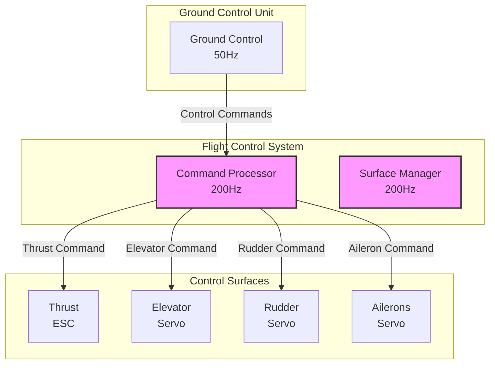
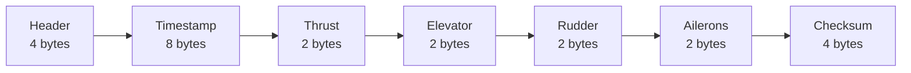
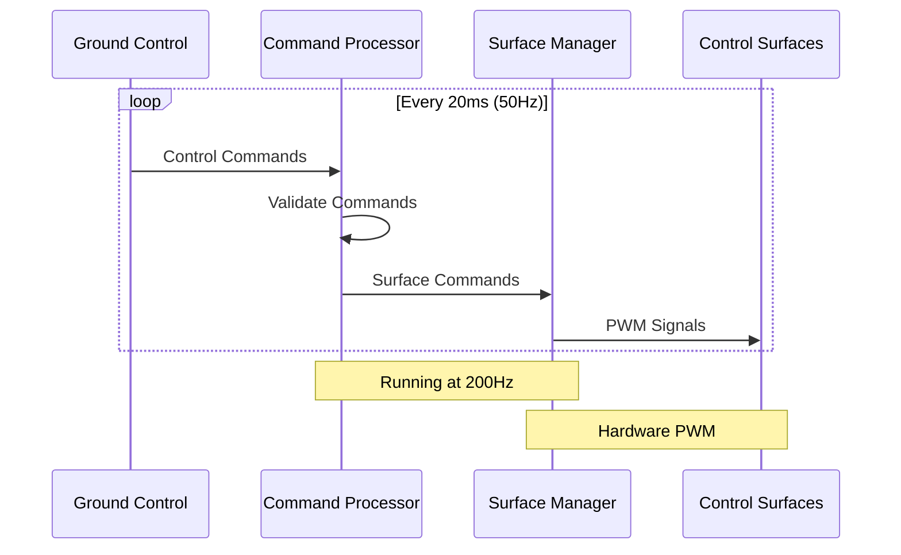
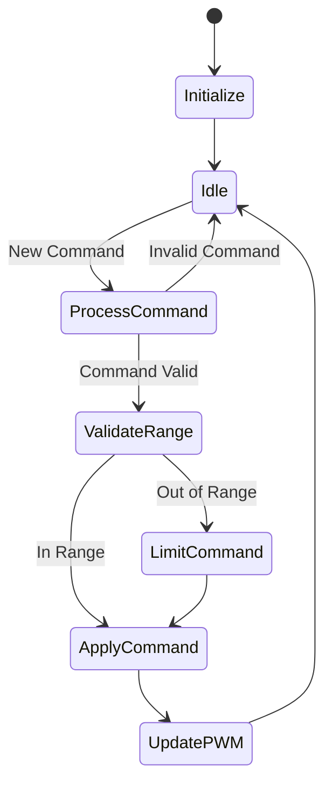
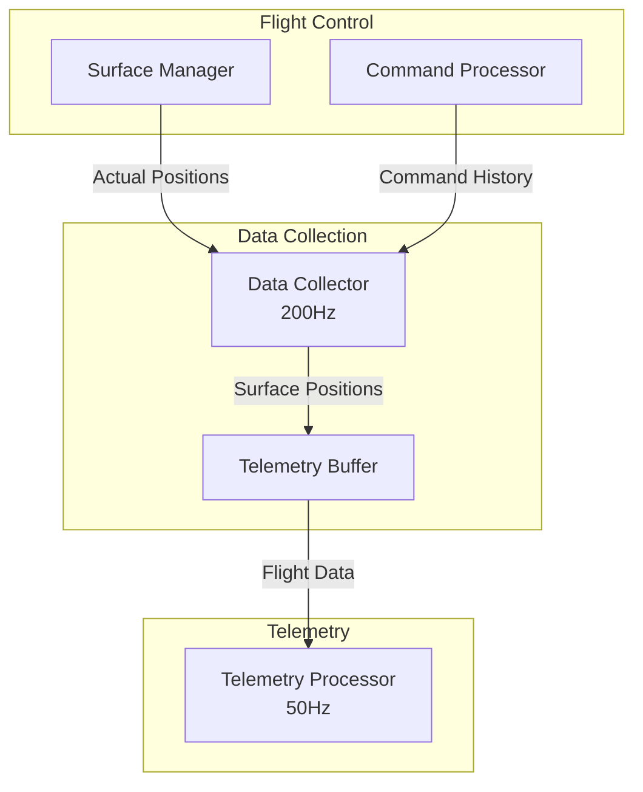
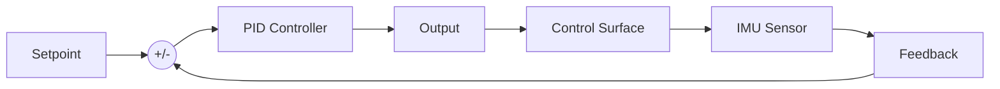
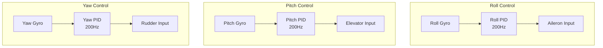
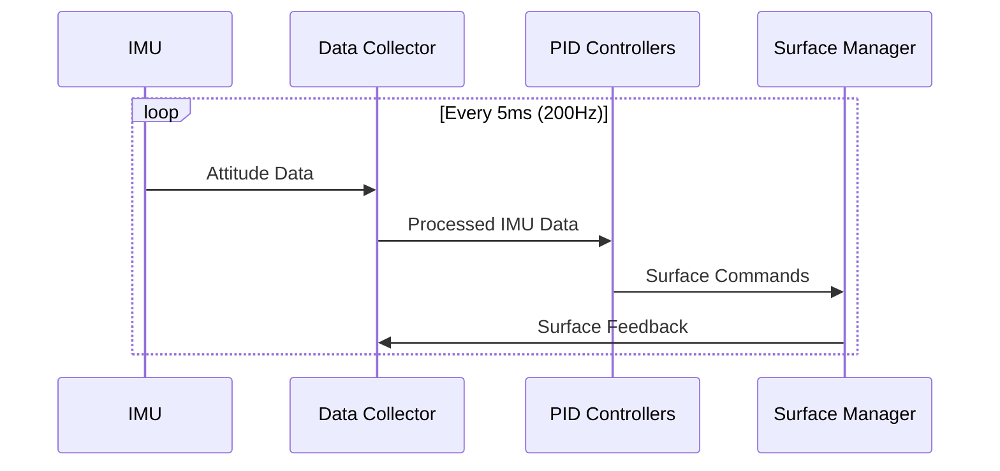

# Flight Control System
Version: 1.0.0  
Last Updated: 2024

## Table of Contents
1. [System Overview](#system-overview)
2. [Direct Control Implementation](#direct-control-implementation)
3. [Control Surface Integration](#control-surface-integration)
4. [Sensor Integration](#sensor-integration)
5. [Future IMU-Assisted Flight](#future-imu-assisted-flight)

## System Overview

The flight control system manages the drone's control surfaces based on commands from the Ground Control Unit (GCU). The system initially implements direct control mapping while providing a foundation for future IMU-assisted flight capabilities.

### Control Architecture

## Direct Control Implementation

### Command Structure

### Control Ranges
| Control Surface | Range | Resolution | Update Rate |
|----------------|-------|------------|-------------|
| Thrust (ESC)   | 0-100%| 0.1%      | 200Hz       |
| Elevator       | ±30°  | 0.1°      | 200Hz       |
| Rudder         | ±30°  | 0.1°      | 200Hz       |
| Ailerons       | ±30°  | 0.1°      | 200Hz       |

### Control Flow

## Control Surface Integration

### Surface Manager Operation

### PWM Configuration
- Frequency: 50Hz (20ms period)
- Resolution: 12-bit (4096 steps)
- Pulse Range: 1000μs - 2000μs
- Neutral Positions:
  - Thrust (ESC): 1000μs (0% power)
  - Control Surfaces (Elevator, Rudder, Ailerons): 1500μs (centered)

## Sensor Integration

### Data Collector Interface

### Telemetry Data Structure
- Current surface positions
- Command values
- Command execution timestamps
- Surface response times
- Error conditions

## Future IMU-Assisted Flight

### PID Control Overview

### PID Implementation Strategy

1. **Attitude Control Loops**

2. **Control Parameters**
   - **Roll Control**
     - Kp: Initial attitude correction
     - Ki: Trim correction
     - Kd: Rate damping
     - Update Rate: 200Hz
   
   - **Pitch Control**
     - Kp: Initial attitude correction
     - Ki: Trim correction
     - Kd: Rate damping
     - Update Rate: 200Hz
   
   - **Yaw Control**
     - Kp: Initial heading correction
     - Ki: Trim correction
     - Kd: Rate damping
     - Update Rate: 200Hz

### IMU Data Integration

### Implementation Phases

1. **Phase 1: Data Collection**
   - Collect IMU data during direct control
   - Monitor control surface response
   - Gather flight characteristics
   - No active control

2. **Phase 2: Single-Axis Stabilization**
   - Implement roll stabilization
   - PID tuning for roll axis
   - Manual control override
   - Performance validation

3. **Phase 3: Full Attitude Control**
   - Add pitch and yaw control
   - Multi-axis PID tuning
   - Mode switching logic
   - Safety monitoring

4. **Phase 4: Advanced Features**
   - Altitude hold
   - Heading hold
   - Return-to-home assistance
   - Autonomous capabilities

### Safety Considerations
- Gradual PID engagement
- Control authority limits
- Manual override capability
- Sensor failure detection
- PID output limiting
- Anti-windup protection 