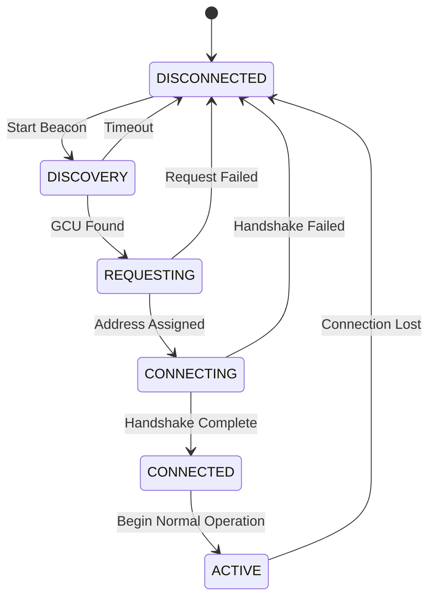
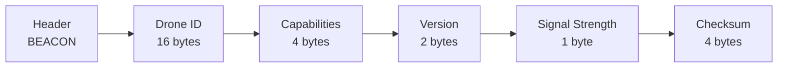
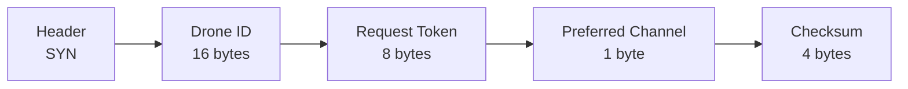
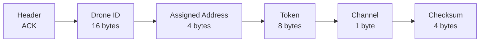
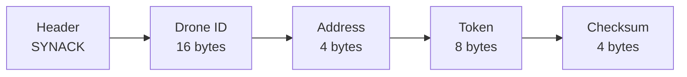
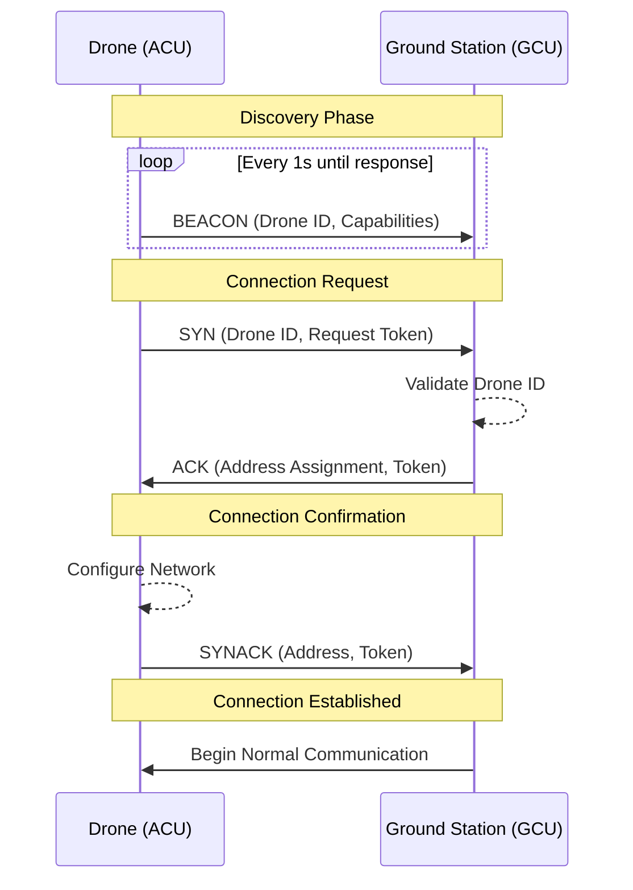
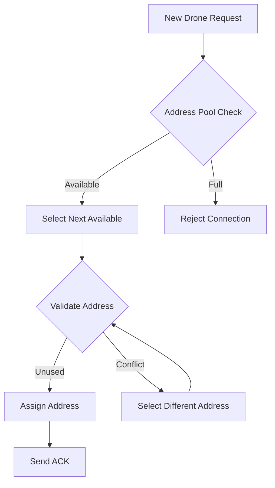
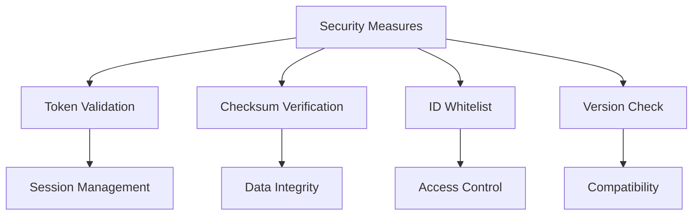

# Drone Communication System: Initialization Process
Version: 1.0.0  
Last Updated: 2024

## Table of Contents
1. [Overview](#overview)
2. [Connection States](#connection-states)
3. [Packet Specifications](#packet-specifications)
4. [Connection Process](#connection-process)
5. [Address Assignment](#address-assignment)
6. [Security Considerations](#security-considerations)

## Overview

The initialization process establishes secure connections between the Ground Control Unit (GCU) and multiple Air Control Units (ACUs). The process follows a DHCP-like discovery and handshake protocol, operating over monitor mode WiFi connections.

### Key Features
- Multiple drone support
- Automatic discovery
- Three-way handshake
- Unique address assignment
- Connection state verification

## Connection States

## Packet Specifications

### Discovery Packet (BEACON)

### Connection Request (SYN)

### Address Assignment (ACK)

### Connection Confirmation (SYNACK)

## Connection Process

### Complete Handshake Sequence

## Address Assignment

### Address Space
- Network ID: 172.16.0.0/16 (Drone Network)
- Available Hosts: 65,534
- Reserved Addresses:
  - 172.16.0.1: Ground Station
  - 172.16.0.2-172.16.255.254: Drone Pool
  - 172.16.255.255: Broadcast

### Assignment Process

## Security Considerations

### Token Generation
1. **Request Token**
   - 64-bit random value
   - Generated by drone
   - Used for initial request

2. **Session Token**
   - 64-bit random value
   - Generated by ground station
   - Used for ongoing communication

### Validation Process
1. **Beacon Phase**
   - Verify drone ID against whitelist
   - Check firmware version
   - Validate capabilities

2. **Connection Phase**
   - Validate all checksums
   - Verify token matches
   - Confirm address assignment

### Security Measures

## Implementation Notes

### Ground Station Requirements
1. **Connection Manager**
   - Track active connections
   - Manage address pool
   - Handle multiple simultaneous requests

2. **Monitor Mode Configuration**
   - Channel hopping for discovery
   - Signal strength monitoring
   - Interference detection

3. **Connection States**
   - Track each drone's state
   - Handle timeout conditions
   - Manage reconnection attempts

### Drone Requirements
1. **Beacon Mode**
   - Configurable beacon interval
   - Signal strength monitoring
   - Channel scanning

2. **Connection Handler**
   - Process address assignment
   - Validate tokens
   - Configure network interface

3. **State Management**
   - Track connection state
   - Handle timeout conditions
   - Manage reconnection attempts 