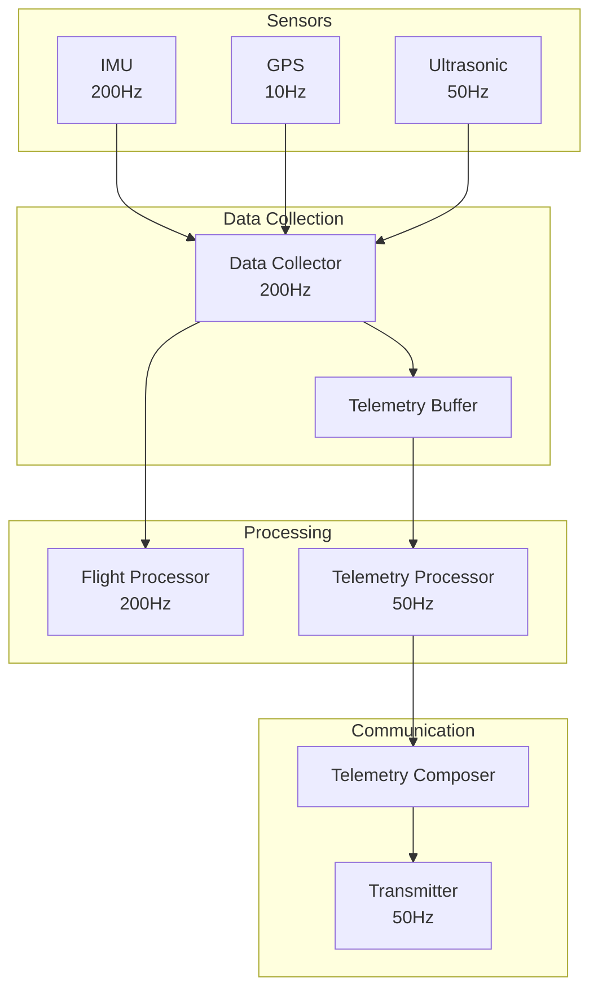
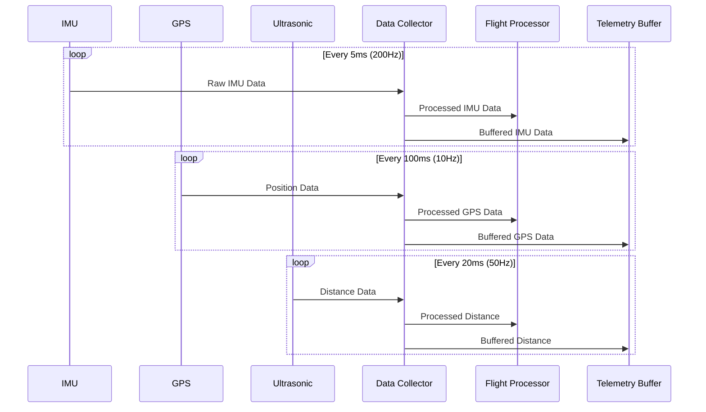
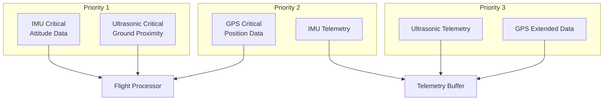
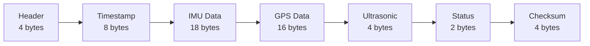
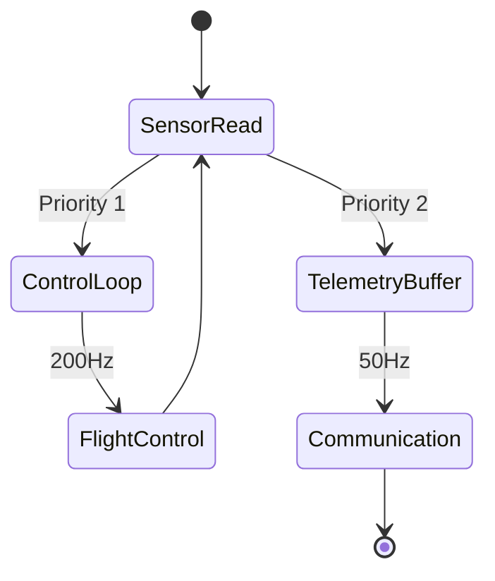

# Drone Sensor and Telemetry System
Version: 1.0.0  
Last Updated: 2024

## Table of Contents
1. [System Overview](#system-overview)
2. [Sensor Specifications](#sensor-specifications)
3. [Data Collection Architecture](#data-collection-architecture)
4. [Communication Process](#communication-process)
5. [Control Loop Integration](#control-loop-integration)
6. [Performance Considerations](#performance-considerations)

## System Overview

The drone's sensor and telemetry system provides critical real-time data for flight control, navigation, and status monitoring. The system is designed to ensure reliable data collection while minimizing interference with the control loop.

### High-Level Architecture

## Sensor Specifications

### 1. Inertial Measurement Unit (IMU)
- **Update Rate**: 200Hz
- **Measurements**:
  - Acceleration (3-axis)
  - Angular velocity (3-axis)
  - Magnetic heading (3-axis)
- **Resolution**:
  - Accelerometer: ±16g
  - Gyroscope: ±2000°/s
  - Magnetometer: ±16 Gauss

### 2. GPS Module
- **Update Rate**: 10Hz
- **Measurements**:
  - Latitude/Longitude
  - Altitude
  - Ground speed
  - Course
  - Satellites in view
- **Accuracy**:
  - Position: ±2.5m
  - Velocity: ±0.1m/s

### 3. Ultrasonic Sensor
- **Update Rate**: 50Hz
- **Range**: 0.2m - 50m
- **Beam Angle**: 15°
- **Resolution**: ±1cm
- **Use Cases**:
  - Ground distance measurement
  - Landing assistance
  - Terrain following

## Data Collection Architecture

### Sensor Data Flow

### Data Priority Levels

## Communication Process

### Telemetry Packet Structure

### Communication Timeline

```mermaid
gantt
    title Communication Cycle (20ms)
    dateFormat X
    axisFormat %L
    
    section Control Loop
    Flight Control    :0, 5
    
    section Sensors
    IMU Reading      :0, 1
    GPS Reading      :1, 2
    Ultrasonic      :2, 3
    
    section Processing
    Data Processing  :3, 4
    
    section Communication
    Packet Assembly  :4, 5
    Transmission     :5, 6
```

## Control Loop Integration

### Processing Priority

### Resource Management
- Control loop runs at 200Hz (5ms cycle)
- Telemetry transmission at 50Hz (20ms cycle)
- Sensor readings are interrupt-driven
- Double buffering prevents data conflicts

## Performance Considerations

### Timing Requirements
1. **Critical Path**
   - Sensor reading to control output: <3ms
   - Maximum jitter tolerance: ±0.5ms
   - Control loop deadline: 5ms

2. **Telemetry Path**
   - Buffer to transmission: <10ms
   - Maximum packet size: 56 bytes
   - Transmission window: 2ms

### Resource Utilization
- CPU usage peaks:
  - Control loop: 30%
  - Telemetry processing: 15%
  - Sensor processing: 20%
- Memory footprint:
  - Telemetry buffer: 4KB
  - Sensor data: 1KB
  - Processing overhead: 2KB

### Conflict Resolution
1. **Control Priority**
   - Control loop always preempts telemetry
   - Sensor readings use interrupt priorities:
     - IMU: Highest
     - Ultrasonic: Medium
     - GPS: Lowest

2. **Buffer Management**
   - Double buffering for telemetry
   - Ring buffer for sensor data
   - Atomic operations for shared data

3. **Failsafe Mechanisms**
   - Watchdog timer: 10ms
   - Sensor timeout detection
   - Buffer overflow protection 