# UDP Protocol Specification
Version: 1.0.0  
Last Updated: 2024

## Table of Contents
1. [Introduction to UDP](#introduction-to-udp)
2. [Protocol Overview](#protocol-overview)
3. [Packet Structures](#packet-structures)
4. [Communication Patterns](#communication-patterns)
5. [Reliability Mechanisms](#reliability-mechanisms)
6. [Implementation Guide](#implementation-guide)

## Introduction to UDP

### What is UDP?
User Datagram Protocol (UDP) is a lightweight, connectionless networking protocol. Think of it as sending postcards through the mail:
- No guarantee of delivery
- No guarantee of order
- No built-in error checking
- No connection setup required

### Why UDP for Drone Control?
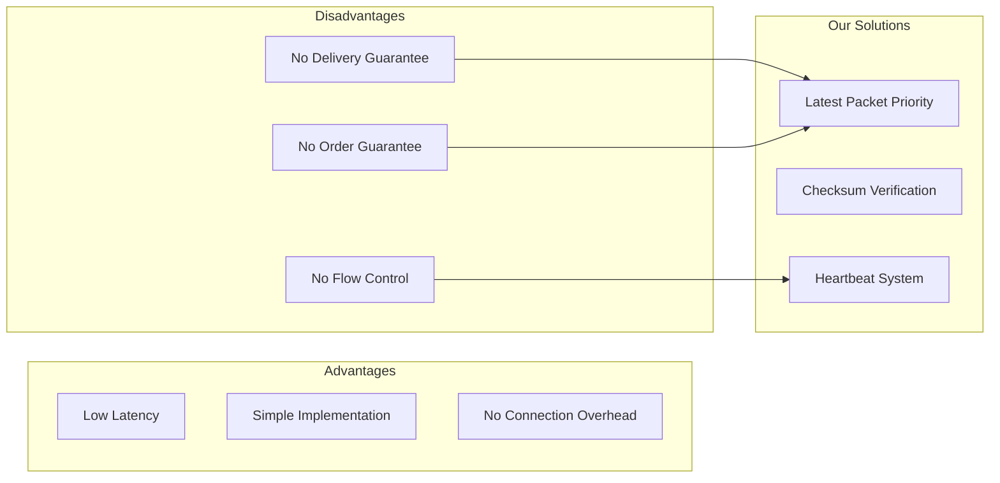

## Protocol Overview

### Communication Layers

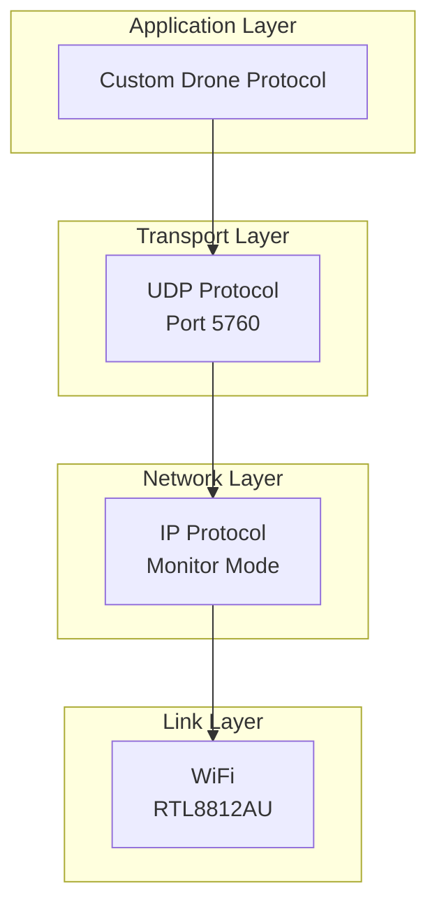

### Basic Packet Flow

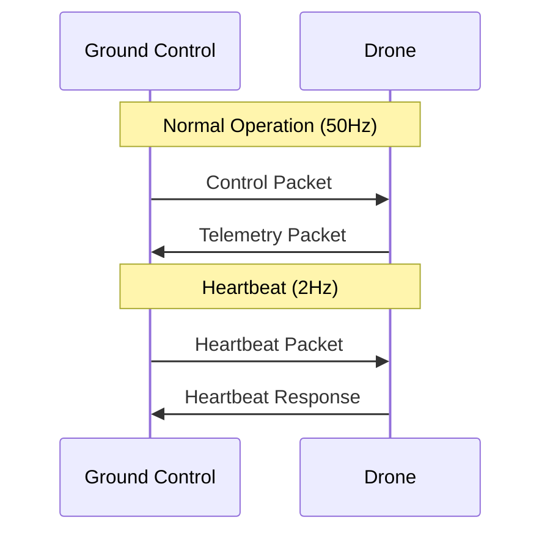

## Packet Structures

### Common Header Format
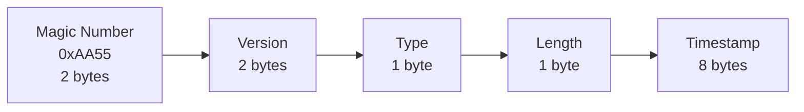

### 1. Control Packet (Type 0x01)
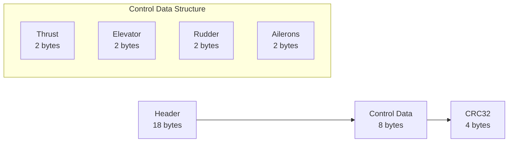

### 2. Telemetry Packet (Type 0x02)
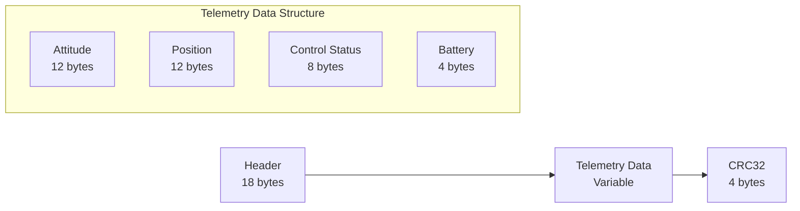

### 3. Heartbeat Packet (Type 0x03)
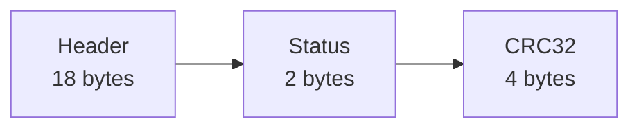

## Communication Patterns

### Normal Operation Mode

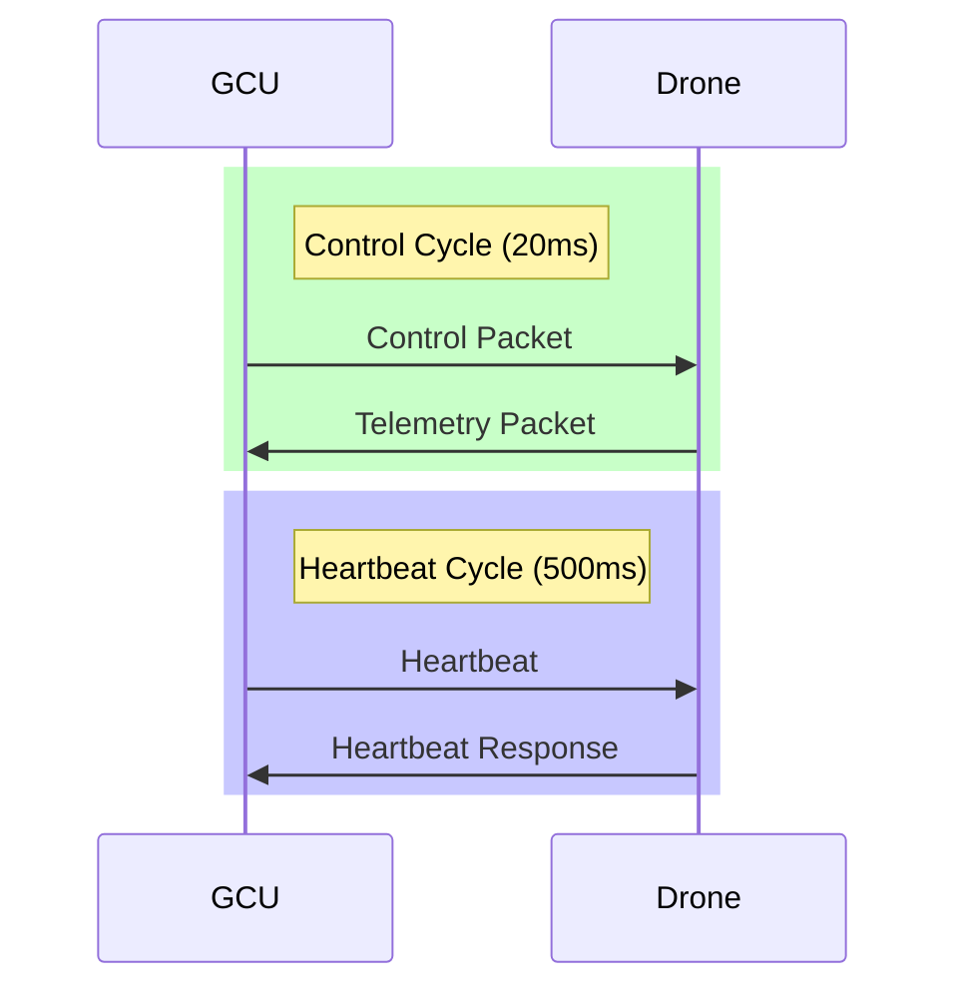

### Packet Processing Flow

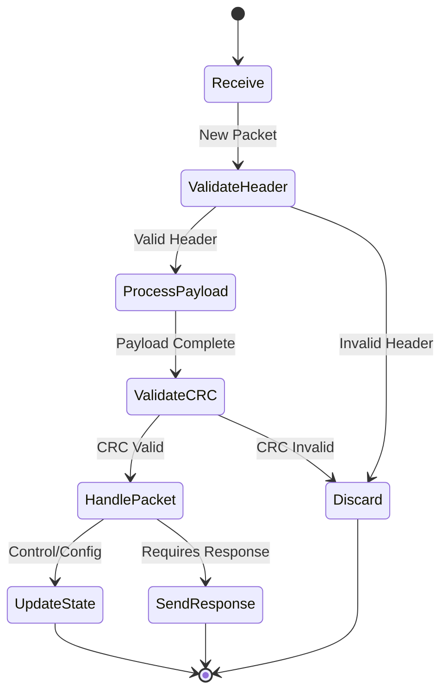

## Reliability Mechanisms

### Real-time Processing Priority

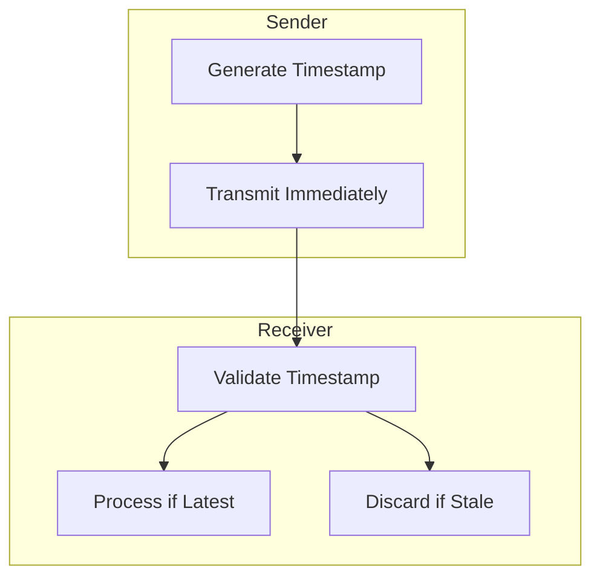

### Error Detection

1. **Timestamp Validation**
   ```mermaid
   graph LR
       T[Timestamp Check] --> V[Validate Freshness]
       V --> P[Process/Discard]
   ```

2. **Real-time Processing**
   - Immediate processing of fresh packets
   - No packet ordering or buffering
   - Stale packet detection and discard
   - Microsecond timestamp precision

### Connection Monitoring

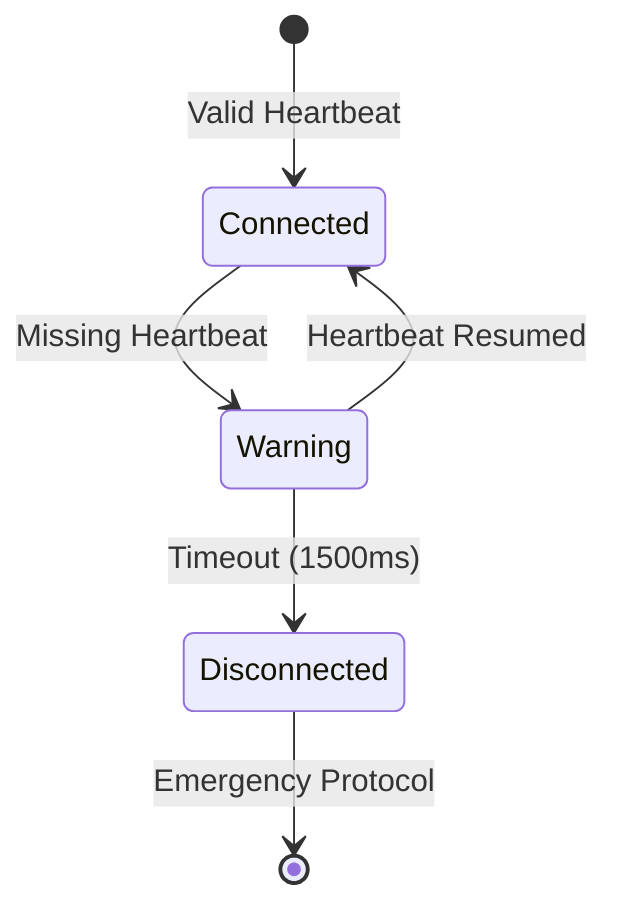

## Implementation Guide

### Packet Assembly Example (Python-like Pseudocode)
```python
def create_control_packet(thrust, elevator, rudder, ailerons):
    packet = bytearray()
    
    # Header (14 bytes)
    packet.extend(MAGIC_NUMBER)        # 2 bytes
    packet.extend(PROTOCOL_VERSION)    # 2 bytes
    packet.append(PACKET_TYPE_CONTROL) # 1 byte
    packet.append(CONTROL_LENGTH)      # 1 byte
    packet.extend(get_timestamp())     # 8 bytes
    
    # Control Data (8 bytes)
    packet.extend(struct.pack('H', thrust))    # 2 bytes
    packet.extend(struct.pack('H', elevator))  # 2 bytes
    packet.extend(struct.pack('H', rudder))    # 2 bytes
    packet.extend(struct.pack('H', ailerons))  # 2 bytes
    
    # CRC32 (4 bytes)
    crc = calculate_crc32(packet)
    packet.extend(struct.pack('I', crc))
    
    return packet
```

### Receiving Process
1. **Packet Processing**
   ```mermaid
   graph TB
       R[Receive] --> T[Timestamp Check]
       T --> F{Fresh?}
       F -->|Yes| P[Process]
       F -->|No| D[Discard]
   ```

2. **Validation Steps**
   - Magic number check
   - Version compatibility
   - Timestamp freshness
   - CRC validation

### Error Handling
1. **Packet Processing**
   - Immediate processing of fresh packets
   - No reordering or buffering
   - Stale packet detection
   - Latest data priority

2. **Corruption**
   - CRC32 verification
   - Header validation
   - Length checking
   - Type validation

3. **Timing**
   - Timestamp validation
   - Freshness window
   - Stale packet rejection

### Best Practices
1. **Real-time Processing**
   - Zero-buffering policy
   - Immediate validation
   - Direct processing pipeline
   - Minimal overhead

2. **Timing**
   - Use monotonic clock
   - Maintain time sync
   - Microsecond precision
   - Rolling freshness window

3. **Error Recovery**
   - Immediate error detection
   - No retry mechanism
   - Latest packet priority
   - Fast failure detection

### Error Handling
1. **Packet Loss**
   - Use sequence gaps to detect
   - Implement packet request system
   - Maintain last known good state

2. **Corruption**
   - CRC32 verification
   - Header validation
   - Length checking
   - Type validation

3. **Out of Order**
   - Sequence number tracking
   - Reordering buffer
   - Timeout handling

### Best Practices
1. **Buffer Management**
   - Pre-allocate buffers
   - Implement ring buffers
   - Handle buffer overflow

2. **Timing**
   - Use monotonic clock
   - Handle wraparound
   - Maintain precision

3. **Error Recovery**
   - Implement backoff
   - State reconciliation
   - Connection re-establishment 