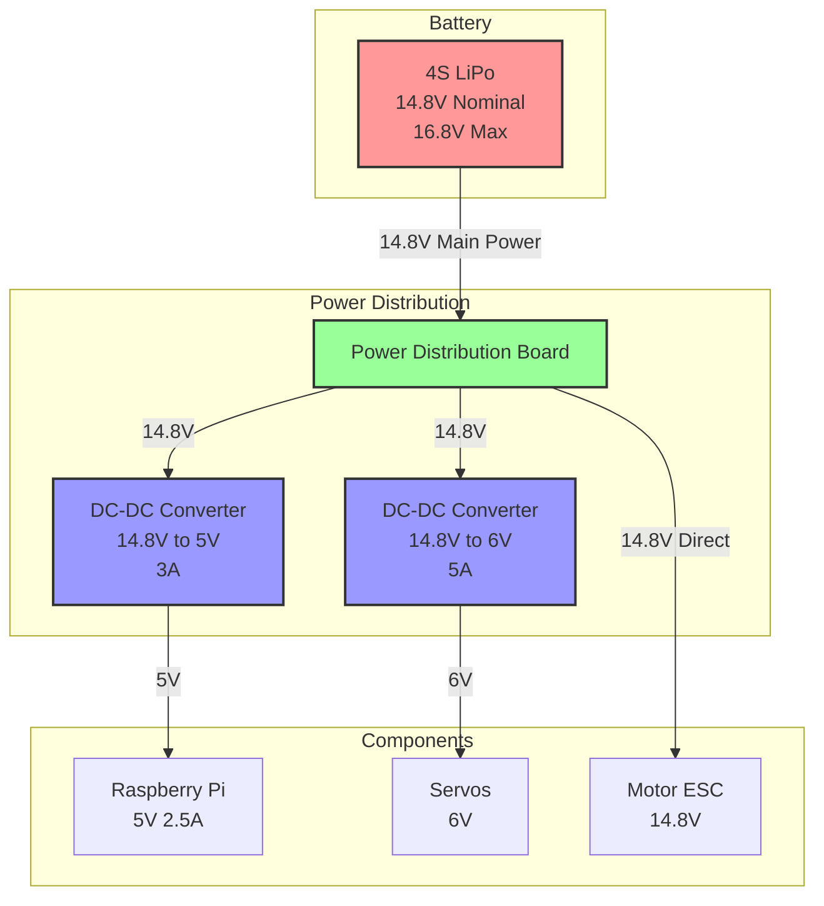

# ACU Wiring Diagrams
Version: 1.0.0  
Last Updated: 2024

## Table of Contents
1. [GPIO Connections](#gpio-connections)
2. [Power Distribution](#power-distribution)
3. [Component Specifications](#component-specifications)
4. [Assembly Notes](#assembly-notes)

## GPIO Connections

### Raspberry Pi Zero 2W to Sensors

```mermaid
graph TB
    subgraph Raspberry Pi Zero 2W
        GPIO1[GPIO 1 - 3.3V]
        GPIO2[GPIO 2 - 5V]
        GPIO3[GPIO 3 - SDA1/GPIO 2]
        GPIO4[GPIO 4 - 5V]
        GPIO5[GPIO 5 - SCL1/GPIO 3]
        GPIO6[GPIO 6 - GND]
        GPIO13[GPIO 13]
        GPIO16[GPIO 16]
        GPIO18[GPIO 18]
        GPIO19[GPIO 19]
        GPIO20[GPIO 20]
        GPIO21[GPIO 21]
        GND1[GND]
        GND2[GND]
        UART_TX[GPIO 14 - UART TX]
        UART_RX[GPIO 15 - UART RX]
    end

    subgraph MPU6050
        IMU_VCC[VCC]
        IMU_GND[GND]
        IMU_SCL[SCL]
        IMU_SDA[SDA]
    end

    subgraph HC-SR04
        US_VCC[VCC]
        US_GND[GND]
        US_TRIG[TRIG]
        US_ECHO[ECHO]
    end

    subgraph GT-U7 GPS
        GPS_VCC[VCC]
        GPS_GND[GND]
        GPS_TX[TX]
        GPS_RX[RX]
    end

    subgraph Servo Control
        SERVO1[Elevator]
        SERVO2[Rudder]
        SERVO3[Ailerons]
        ESC[Motor ESC]
    end

    %% IMU Connections
    GPIO1 --> IMU_VCC
    GPIO3 --> IMU_SDA
    GPIO5 --> IMU_SCL
    GND1 --> IMU_GND

    %% Ultrasonic Connections
    GPIO2 --> US_VCC
    GPIO13 --> US_TRIG
    GPIO16 --> US_ECHO
    GND1 --> US_GND

    %% GPS Connections
    GPIO4 --> GPS_VCC
    UART_TX --> GPS_RX
    UART_RX --> GPS_TX
    GND2 --> GPS_GND

    %% Servo Connections
    GPIO18 --> SERVO1
    GPIO19 --> SERVO2
    GPIO20 --> SERVO3
    GPIO21 --> ESC

    style Raspberry Pi Zero 2W fill:#f9f,stroke:#333,stroke-width:2px
    style MPU6050 fill:#bbf,stroke:#333,stroke-width:2px
    style HC-SR04 fill:#bfb,stroke:#333,stroke-width:2px
    style GT-U7 GPS fill:#fbf,stroke:#333,stroke-width:2px
    style Servo Control fill:#ffb,stroke:#333,stroke-width:2px
```

### GPIO Pin Assignments

| Component | Pin Function | GPIO Number | Notes |
|-----------|-------------|-------------|-------|
| MPU6050   | VCC         | 1 (3.3V)   | Power |
|           | GND         | 6          | Ground |
|           | SDA         | 3          | I2C Data |
|           | SCL         | 5          | I2C Clock |
| HC-SR04   | VCC         | 2 (5V)     | Power |
|           | GND         | 6          | Ground |
|           | TRIG        | 13         | Trigger |
|           | ECHO        | 16         | Echo |
| GT-U7 GPS | VCC         | 4 (5V)     | Power |
|           | GND         | 6          | Ground |
|           | TX          | 15         | UART RX |
|           | RX          | 14         | UART TX |
| Servos    | Elevator    | 18         | PWM |
|           | Rudder      | 19         | PWM |
|           | Ailerons    | 20         | PWM |
| ESC       | Signal      | 21         | PWM |

## Power Distribution

### 4S LiPo to Components

### Power Requirements

| Component | Voltage | Current Draw | Peak Current |
|-----------|---------|--------------|--------------|
| Raspberry Pi | 5V | 700mA | 2.5A |
| Servos (each) | 6V | 500mA | 2A |
| Motor ESC | 14.8V | Variable | 40A |
| MPU6050 | 3.3V | 3.9mA | 10mA |
| HC-SR04 | 5V | 15mA | 20mA |
| GT-U7 GPS | 5V | 45mA | 50mA |

### DC-DC Converter Specifications

1. **5V Converter (DCDC1)**
   - Input: 14.8V (4S LiPo)
   - Output: 5V
   - Continuous Current: 3A
   - Peak Current: 4A
   - Efficiency: >90%
   - Cooling: Heatsink recommended

2. **6V Converter (DCDC2)**
   - Input: 14.8V (4S LiPo)
   - Output: 6V
   - Continuous Current: 5A
   - Peak Current: 6A
   - Efficiency: >90%
   - Cooling: Heatsink required

## Component Specifications

### Battery
- Type: 4S LiPo
- Nominal Voltage: 14.8V
- Max Voltage: 16.8V
- Capacity: TBD based on flight time requirements
- Discharge Rate: ≥30C
- Balance Connector: Required
- Low Voltage Cutoff: 3.5V per cell (14.0V total)

### Power Distribution Board
- Current Rating: ≥40A
- Input: 4S LiPo
- Outputs: 
  - Main Power (14.8V)
  - BEC outputs (optional)
- Integrated Current Sensor (optional)

## Assembly Notes

### GPIO Connections
1. **I2C Setup (MPU6050)**
   - Enable I2C in raspi-config
   - Check I2C address (typically 0x68)
   - Use pull-up resistors if needed

2. **UART Setup (GPS)**
   - Disable serial console in raspi-config
   - Enable UART
   - Set baud rate to 9600

3. **PWM Setup**
   - Use hardware PWM pins when possible
   - Configure for 50Hz update rate
   - Test servo endpoints before assembly

### Power System
1. **Safety Requirements**
   - Add power switch
   - Include fuse protection
   - Monitor battery voltage
   - Add filtering capacitors

2. **Wiring Guidelines**
   - Use appropriate gauge wire
   - Minimize wire length
   - Add connectors for serviceability
   - Label all connections

3. **Testing Procedure**
   - Test DC-DC converters before connecting components
   - Verify voltages at all points
   - Monitor temperature during testing
   - Test under load

### Recommended Tools
- Multimeter
- Soldering iron
- Heat shrink tubing
- Wire strippers
- Crimping tool
- Power supply for testing 